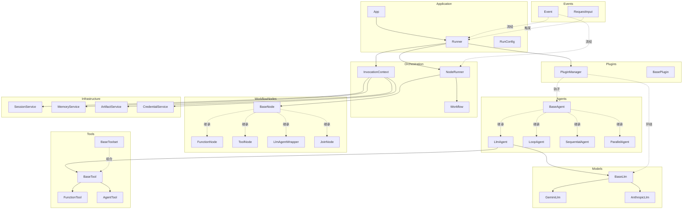
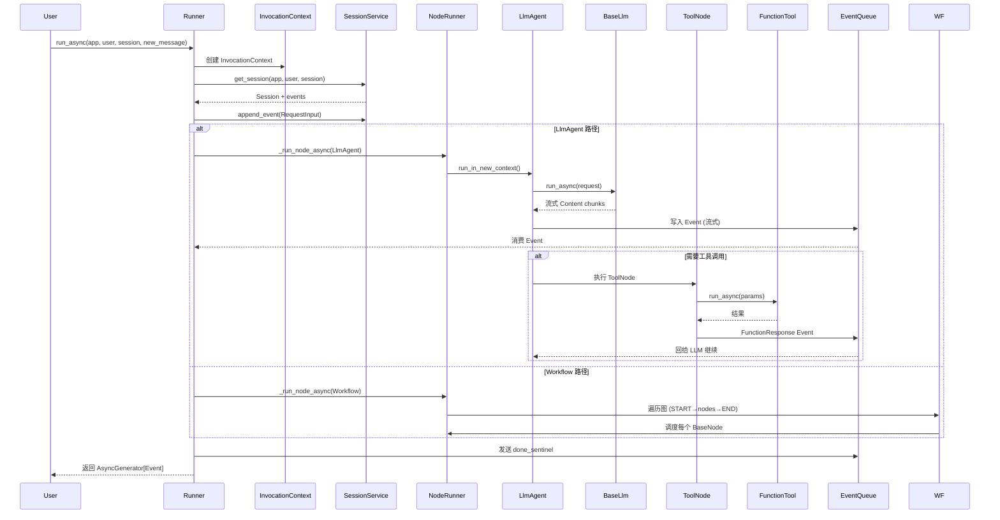
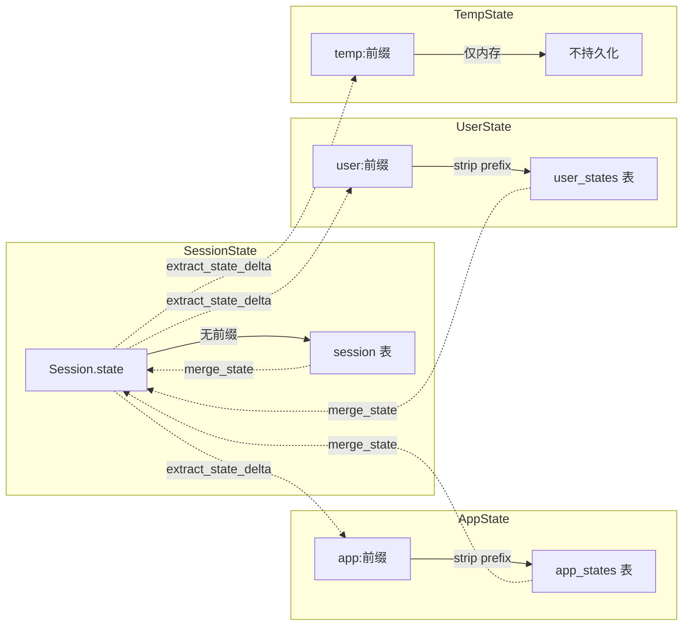

# ADK Mermaid 架构图

## 模块依赖图

```mermaid
graph TB
    subgraph Application
        App[App]
        Runner[Runner]
        RunConfig[RunConfig]
    end

    subgraph Orchestration
        IC[InvocationContext]
        NM[NodeRunner]
        WF[Workflow]
    end

    subgraph Agents
        BA[BaseAgent]
        LA[LlmAgent]
        LoopA[LoopAgent]
        SeqA[SequentialAgent]
        ParaA[ParallelAgent]
    end

    subgraph WorkflowNodes
        BN[BaseNode]
        FN[FunctionNode]
        TN[ToolNode]
        LAW[LlmAgentWrapper]
        JN[JoinNode]
    end

    subgraph Models
        BLLM[BaseLlm]
        GLLM[GeminiLlm]
        ALLM[AnthropicLlm]
    end

    subgraph Tools
        BT[BaseTool]
        FT[FunctionTool]
        AT[AgentTool]
        BTT[BaseToolset]
    end

    subgraph Infrastructure
        SS[SessionService]
        MS[MemoryService]
        AS[ArtifactService]
        CS[CredentialService]
    end

    subgraph Events
        Event[Event]
        RI[RequestInput]
    end

    subgraph Plugins
        PM[PluginManager]
        BP[BasePlugin]
    end

    App --> Runner
    Runner --> IC
    Runner --> NM
    Runner --> PM

    IC --> SS
    IC --> MS
    IC --> AS
    IC --> CS

    NM --> WF
    NM --> BN

    BA -.继承.-> LA
    BA -.继承.-> LoopA
    BA -.继承.-> SeqA
    BA -.继承.-> ParaA

    BN -.继承.-> FN
    BN -.继承.-> TN
    BN -.继承.-> LAW
    BN -.继承.-> JN

    LA --> BLLM
    BLLM --> GLLM
    BLLM --> ALLM

    LA --> BT
    BT --> FT
    BT --> AT
    BTT -.组合.-> BT

    Event -.流经.-> Runner
    Event -.流经.-> NM
    RI -.触发.-> Runner

    PM -.钩子.-> BA
    PM -.环绕.-> BLLM
```

## 调用生命周期

```mermaid
sequenceDiagram
    participant User
    participant Runner
    participant IC as InvocationContext
    participant SS as SessionService
    participant NM as NodeRunner
    participant Agent as LlmAgent
    participant LLM as BaseLlm
    participant TN as ToolNode
    participant Tool as FunctionTool
    participant EQ as EventQueue

    User->>Runner: run_async(app, user, session, new_message)
    Runner->>IC: 创建 InvocationContext
    Runner->>SS: get_session(app, user, session)
    SS-->>Runner: Session + events

    Runner->>SS: append_event(RequestInput)

    alt LlmAgent 路径
        Runner->>NM: _run_node_async(LlmAgent)
        NM->>Agent: run_in_new_context()
        Agent->>LLM: run_async(request)
        LLM-->>Agent: 流式 Content chunks
        Agent->>EQ: 写入 Event (流式)
        EQ-->>Runner: 消费 Event

        alt 需要工具调用
            Agent->>TN: 执行 ToolNode
            TN->>Tool: run_async(params)
            Tool-->>TN: 结果
            TN->>EQ: FunctionResponse Event
            EQ-->>Agent: 回给 LLM 继续
        end

    else Workflow 路径
        Runner->>NM: _run_node_async(Workflow)
        NM->>WF: 遍历图 (START→nodes→END)
        WF->>NM: 调度每个 BaseNode
    end

    Runner->>EQ: 发送 done_sentinel
    Runner-->>User: 返回 AsyncGenerator[Event]
```

## 状态分治架构

```mermaid
graph LR
    subgraph SessionState
        S[Session.state]
        S -->|"无前缀"| ST[session 表]
    end

    subgraph AppState
        A["app:前缀"]
        A -->|"strip prefix"| AST[app_states 表]
    end

    subgraph UserState
        U["user:前缀"]
        U -->|"strip prefix"| UST[user_states 表]
    end

    subgraph TempState
        T["temp:前缀"]
        T -->|"仅内存"| MEM[不持久化]
    end

    S -.extract_state_delta.-> A
    S -.extract_state_delta.-> U
    S -.extract_state_delta.-> T

    ST -.merge_state.-> S
    AST -.merge_state.-> S
    UST -.merge_state.-> S
```
