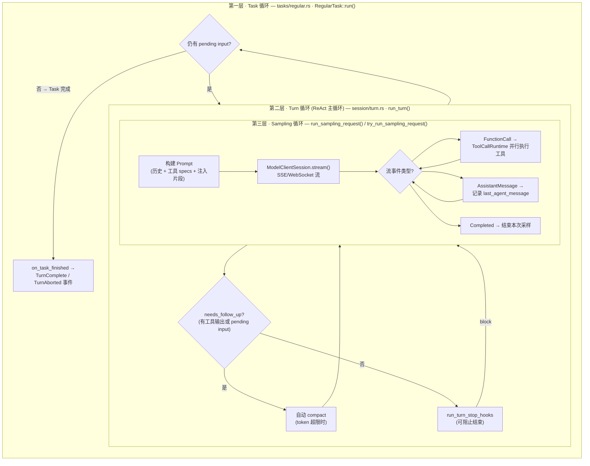
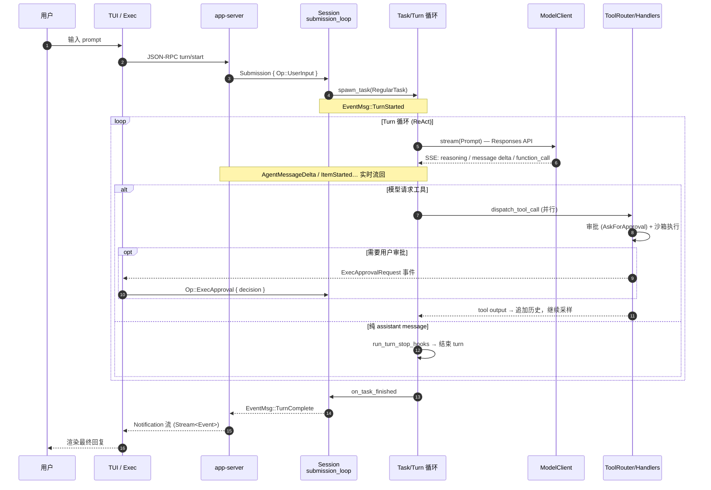

# Codex Runtime 架构

> 范围说明：本文聚焦 Session、Submission 与 Turn Loop，基于 commit `7750465934d97dd3cbcb3b1655d2f622744010d3`。产品入口、协议、扩展、安全和持久化的全局关系见 [Codex 项目全局架构](codex-global-architecture.md)。

> 本文档描述 Codex CLI（`codex-rs`）的运行时（Runtime）架构：从用户输入进入系统，到模型采样、工具执行、事件流回前端的完整链路。
> 结构上对标通用 Agent Runtime 模型（User → Runner/Event Loop → Execution Logic → Services → Storage）。

## 1. 总览：High-level Runtime 设计

- [当前版：High-level Runtime 架构](./codex-runtime-architecture.excalidraw)
- [精简前详细版](./codex-runtime-architecture-before-simplification.excalidraw)
- [本次修改前版本](./codex-runtime-architecture-pre-revision.excalidraw)
- [更早备份版本](./codex-runtime-architecture-bk.excalidraw)

这张图刻意隐藏线程管理、配置装配和具体 Rust 类型，强调五个稳定的设计关系：

1. TUI、Exec 与 SDK 通过 `app-server` 进入 Core，运行事件再以通知流返回前端。
2. `Session Runtime` 是一次持续对话的执行边界，内部以 Submission、Task、Turn 三层组织工作。
3. Turn Loop 在模型采样与工具执行之间迭代，直到不再需要后续采样。
4. Runtime Services 为 Session 提供认证、Skills、Plugins、MCP、Hooks 与 Telemetry 等横切能力。
5. Storage 同时保存 Rollout Log 和 State DB；Session 通过同一持久化边界记录运行过程并恢复上下文。

概念主链：`Frontends → app-server → Submission Processing → SessionTask → Turn Loop`。模型与工具形成 Turn 内部的双向执行回路，Storage 则形成 Session 外部的 `record / restore` 回路。

| 架构职责 | High-level 组件 | 关键关系 |
| --- | --- | --- |
| 接入与事件回传 | Frontends + `app-server` | prompt / notification |
| 会话执行边界 | Session Runtime | 串行接收 Submission，管理活动 Task |
| Agent 循环 | Turn Loop | Reason → Act → Observe → follow-up |
| 模型访问 | Model Gateway | Responses API 与流式响应 |
| 工具执行 | Tool Execution | Routing → Policy/Approval → Sandbox → Handler |
| 横切能力 | Runtime Services | Auth、Skills、Plugins、MCP、Hooks、Telemetry |
| 持久化 | Rollout Log + State DB | record / restore |

## 2. 分层职责

### 2.1 前端层（多部署形态）

所有前端最终都汇聚到 `app-server` 的 JSON-RPC API 或直接持有 `ThreadManager`：

- **TUI**（`tui/`）：交互式终端 UI。启动时选择 `InProcessAppServerClient`（内嵌 app-server）或 `RemoteAppServerClient`（连接 daemon / 远程），见 `tui/src/lib.rs` 的 `AppServerTarget`（Embedded / LocalDaemon / Remote）。
- **Exec**（`exec/`）：非交互执行（`codex exec`），输出 JSONL 或人类可读格式，同样走 app-server-client。
- **AppServer**（`app-server/`）：JSON-RPC 服务器，持有 `ThreadManager`，处理 `thread/start`、`turn/start` 等请求，并把 core 的 `Event` 转成 Notification 推送给客户端。
- **MCP Server**（`mcp-server/`）：把 Codex 作为 MCP tool 暴露，stdin/stdout 三任务模型（reader → `MessageProcessor` → writer）。
- **SDK**（`sdk/typescript`、`sdk/python`）：进程外封装 app-server 协议。

### 2.2 线程管理层

- **`ThreadManager`**（`core/src/thread_manager.rs`）：多线程（会话）生命周期入口，提供 `spawn_thread()` / `send_op()` / `get_thread()`；负责 resume/fork 时从 rollout 重建历史。
- **`CodexThread`**（`core/src/codex_thread.rs`）：单个线程的运行时句柄，持有 `Session` 与 `SessionIo`（`tx_sub` 提交通道 + `rx_event` 事件通道）。

### 2.3 Session：Runner 与 Event Processor

`Session`（`core/src/session/session.rs`）是单个线程的运行时核心，等价于通用模型中的 **Runner**：

- **submission_loop**（`core/src/session/handlers.rs`）：SQ（Submission Queue）消费者。从 `rx_sub` 逐条接收 `Submission { id, op }`，按 `Op` 分发：
  - `Op::UserInput` → 启动/追加到 Turn（`user_input_or_turn`）
  - `Op::Interrupt` → 中止 active turn
  - `Op::ExecApproval` / `Op::PatchApproval` / `Op::RequestPermissionsResponse` → 回填审批决定
  - `Op::Compact` / `Op::Review` / `Op::RunUserShellCommand` → 启动对应专用 Task
  - `Op::Shutdown` → `shutdown_session_runtime()` 清理（终止 unified exec 进程、关闭 MCP runtime、跑 session_end hooks）
- **状态**：`active_turn`、`input_queue`（pending input 队列）、`services`（见 §2.5）、会话历史（ContextManager）。

### 2.4 三层 ReAct 循环（Event Loop 核心）

- **第一层 Task 循环**（`core/src/tasks/`）：`SessionTask` trait 的实现（`RegularTask` / `ReviewTask` / `CompactTask` / `UserShellCommandTask`）。`Session::spawn_task()` 会先 `abort_all_tasks(Replaced)` 再 `start_task()`，每个 Task 跑在独立 tokio task 上，持有 `CancellationToken`。职责：处理跨 turn 的 pending input（用户中途插话），确保用户意图不丢失。
- **第二层 Turn 循环**（`run_turn()`，`core/src/session/turn.rs`）：ReAct 主循环。每轮：捕获 `StepContext` → 记录上下文更新/世界状态 diff → 发起采样 → 根据 `needs_follow_up` 决定继续或结束；负责 pre-sampling / mid-turn 自动 compact、skills/plugins 注入、stop hooks 拦截。
- **第三层 Sampling 循环**（`run_sampling_request()` + `try_run_sampling_request()`）：外层是网络容错 retry 循环（`stream_max_retries`），内层是 SSE 流式事件循环——用 `FuturesOrdered` 并行收集工具执行结果，收到 `Completed` 或流中断退出。`ModelClientSession` 是 turn 级作用域，缓存 WebSocket 连接与 sticky routing 状态，跨 retry 复用。

### 2.5 Execution Logic：模型调用与工具分发

- **`ModelClient` / `ModelClientSession`**（`core/src/client.rs`）：封装 provider、认证、conversation 级配置；`stream()` 发起 Responses API 请求并返回事件流。SSE 解析在 `codex-api`（`codex-api/src/sse/responses.rs`）。
- **`ToolRouter`**（`core/src/tools/router.rs`）：`build_tool_call()` 把 `ResponseItem::FunctionCall/CustomToolCall/ToolSearchCall` 归一化为 `ToolCall`，再经 `ToolRegistry` 分发到 handler；`spec_plan.rs` 按 feature/model/环境决定本 turn 暴露给模型的工具集合。
- **主要 Handlers**（`core/src/tools/handlers/`）：

| 类别 | Handler | 说明 |
| --- | --- | --- |
| 命令执行 | `ShellCommandHandler`、`ExecCommandHandler` + `WriteStdinHandler`（unified exec） | 核心执行工具；unified exec 支持持久进程 / stdin 交互 |
| 文件修改 | `ApplyPatchHandler` | 所有文件创建/修改/删除 |
| 代码模式 | `CodeModeExecuteHandler` / `CodeModeWaitHandler` | `exec` / `wait` 工具（code-mode） |
| MCP | `McpHandler`、`ListMcpResourcesHandler` 等 | 经 `McpConnectionSet` 调远端 MCP 工具/资源 |
| 多 Agent | `SpawnAgentHandler` / `WaitAgentHandler` / … (v1 & v2) | 子 agent 生命周期与通信 |
| 交互 | `RequestUserInputHandler`、`RequestPermissionsHandler`、`PlanHandler` | 向用户提问 / 请求权限 / 计划 |
| 其他 | `ViewImageHandler`、`CurrentTimeHandler`、`SleepHandler`、`NewContextWindowHandler` 等 | 工具生态补充 |

- 工具执行前经过审批/沙箱链：`tools/approvals.rs`（`ApprovalAction`，可路由到 Guardian 审查）→ `tools/sandboxing.rs` → 平台沙箱（macOS Seatbelt / Linux Landlock+seccomp（`linux-sandbox`）/ Windows（`windows-sandbox-rs`）），由 `AskForApproval` 与 `SandboxPolicy` 控制。

### 2.6 Services（SessionServices）

`SessionServices`（`core/src/state/service.rs`）聚合了 Session 依赖的全部支撑服务：

- `model_client`（模型调用）、`auth_manager`（`codex-login`：OAuth/API Key/Keyring）
- `mcp_runtime` / `McpConnectionSet`（`codex-mcp`：MCP 连接生命周期、OAuth、必需 server 校验）
- `unified_exec_manager`（持久执行进程管理）、`code_mode_service`
- `exec_policy`（execpolicy 命令策略）、`ApprovalStore` / `NetworkApprovalService`、Guardian 熔断
- `hooks`（`codex-hooks`：session_start/stop、pre/post_tool_use、permission_request 等生命周期钩子）
- `extensions`（Extension API）、`plugins`、`SkillsService`
- `session_telemetry`（`codex-otel`：turn/tool span、token 用量指标）、`analytics_events_client`
- `rollout` / `thread_store`（持久化，见下）

### 2.7 Storage 与 Configuration

- **RolloutRecorder**（`codex-rollout`）：按线程记录 protocol 事件流（JSONL rollout），turn 结束前 `flush_rollout()`；支持 resume / fork 时重建历史。
- **SQLite StateDb**（`codex-state`、`codex-thread-store`）：线程元数据、消息历史、状态数据库。
- **Configuration**（`codex-config` + `core/src/config`）：独立于运行状态存储，分层加载 `config.toml`（全局/profile/CLI overrides/cloud bundle），驱动 features、模型 provider、MCP server 等配置。

## 3. 端到端事件流（1 → 2 → 3）

关键类型链：`UserInput` → `Op` / `Submission`（`codex-protocol`）→ `TurnInput`（input_queue）→ `Prompt` / `ResponseItem`（模型侧）→ `ResponseEvent`（SSE）→ `ToolCall` / `ResponseInputItem`（工具侧）→ `Event` / `EventMsg`（前端侧）。

## 4. 关键设计点

1. **SQ/EQ 双队列解耦**：前端只与 `tx_sub`（提交）和 `rx_event`（事件）两个 channel 交互，Session 内部完全异步；drop 所有 sender 即可终止会话循环。
2. **Turn 级不可变 `TurnContext`**：模型、审批策略、沙箱策略等在 turn 开始时冻结（`session/turn_context.rs`），中途修改在下一 turn 生效。
3. **pending input 不丢失**：用户在模型运行中插话进入 `input_queue`，由 Task 循环在 turn 边界（或采样间隙）drain。
4. **上下文预算**：pre-sampling / mid-turn 自动 compact，token 超限触发 context window 滚动（`new_context_window`）。
5. **一切皆事件**：审批、工具进度、token 计数、错误都作为 `EventMsg` 流出，前端只做渲染；rollout 记录同一事件流实现可回放/可恢复。
6. **工具并行**：`supports_parallel_tool_calls` 的工具（含只读 MCP 工具）在 Sampling 循环中经 `FuturesOrdered` 并行执行，结果按序收集。

## 5. 源码索引

| 模块 | 路径 |
| --- | --- |
| 线程管理 | `codex-rs/core/src/thread_manager.rs`、`codex-rs/core/src/codex_thread.rs` |
| Session / SQ-EQ | `codex-rs/core/src/session/{session.rs, mod.rs, handlers.rs}` |
| Task 循环 | `codex-rs/core/src/tasks/{mod.rs, regular.rs, review.rs, compact.rs}` |
| Turn / Sampling 循环 | `codex-rs/core/src/session/{turn.rs, turn_context.rs, step_context.rs}` |
| 模型客户端 | `codex-rs/core/src/client.rs`、`codex-rs/codex-api/src/sse/responses.rs` |
| 工具系统 | `codex-rs/core/src/tools/{router.rs, registry.rs, spec_plan.rs, handlers/}` |
| 审批与沙箱 | `codex-rs/core/src/tools/{approvals.rs, sandboxing.rs}`、`codex-rs/{sandboxing, linux-sandbox, windows-sandbox-rs}` |
| 协议类型 | `codex-rs/protocol`（`Op` / `Submission` / `Event` / `EventMsg`） |
| 前端 | `codex-rs/{tui, exec, app-server, mcp-server, cli}` |
| 持久化 | `codex-rs/{rollout, state, thread-store}` |
| 支撑服务 | `codex-rs/core/src/state/service.rs`、`codex-rs/{codex-mcp, hooks, otel, login, config}` |
