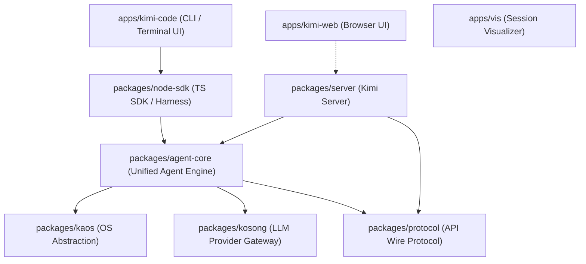
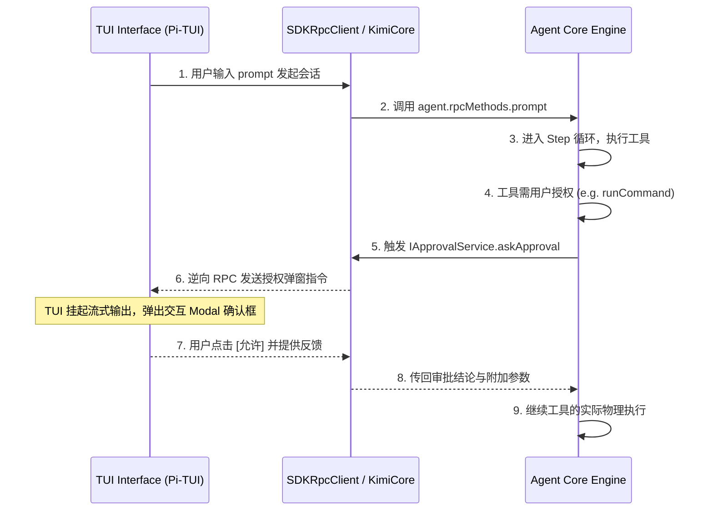

# Kimi Code 核心架构解析

本文档旨在详尽解析本项目的核心架构设计、模块划分、数据/控制流，以及关键组件的生命周期与协作模式。

---

## 1. Monorepo 模块关系与职责划分

本项目采用 TypeScript + pnpm workspace 组织的 Monorepo 架构。整体分为 `apps`（应用层）与 `packages`（核心与公共包）两大目录。以下是关键模块的层级与依赖关系图：



### 核心模块职责说明

| 模块名称 | 职责分类 | 关键入口/文件链接 | 说明 |
| :--- | :--- | :--- | :--- |
| **`apps/kimi-code`** | 应用层 (TUI/CLI) | [main.ts](../../../../kimi-code/apps/kimi-code/src/main.ts) | 终端交互与运行环境，包括交互式 TUI 终端、无交互 Headless 模式等。通过 `node-sdk` 与 Core 交互。 |
| **`apps/kimi-web`** | 应用层 (Web UI) | `apps/kimi-web/src/main.ts` | 浏览器版本的 Web UI，Vue 3 + Vite 构建，通过 REST 与 WebSocket API 接入 `packages/server`。 |
| **`packages/node-sdk`** | 适配层 (SDK) | [kimi-harness.ts](../../../../kimi-code/packages/node-sdk/src/kimi-harness.ts) | 面向 TypeScript/Node 消费者的 SDK，提供进程内 (In-Process) 启动 Kimi Core 后台与管理 Session 的 Harness 连接器。 |
| **`packages/kap-server`** | 接口层 (HTTP/WS) | [start.ts](../../../../kimi-code/packages/kap-server/src/start.ts) | 启动 Kimi Code 后台常驻服务，向 Web UI 或远程 SDK 暴露 REST 及 WebSocket 端点。 |
| **`packages/agent-core`** | 核心层 (Engine) | [index.ts](../../../../kimi-code/packages/agent-core/src/index.ts) | 统一的智能体引擎。管理 Agent 状态、会话记录、权限控制、多智能体协作、计划与执行循环等。 |
| **`packages/kaos`** | 抽象层 (OS) | [kaos.ts](../../../../kimi-code/packages/kaos/src/kaos.ts) | 操作系统抽象层 (Kimi OS)。提供本地 ([local.ts](../../../../kimi-code/packages/kaos/src/local.ts)) 和远程 ([ssh.ts](../../../../kimi-code/packages/kaos/src/ssh.ts)) 的统一命令执行与文件系统操作接口。 |
| **`packages/kosong`** | 适配层 (LLM) | [index.ts](../../../../kimi-code/packages/kosong/src/index.ts) | LLM 网关适配层。抹平了 Moonshot (Kimi)、OpenAI、Gemini、Anthropic 等各大主流模型的 API 差异，支持工具调用与流式解析。 |
| **`packages/protocol`** | 协议层 | `packages/protocol/src/index.ts` | 客户端与服务端、主进程与子进程之间通信所使用的序列化事件、DTO 以及异常错误码定义。 |

---

## 2. 核心引擎架构 (`packages/agent-core`)

[packages/agent-core](../../../../kimi-code/packages/agent-core/src) 是本项目的逻辑中枢。

### 2.1 依赖注入 (DI) 与生命周期管理
系统采用了松耦合的依赖注入机制（类似于 VS Code 的 Instantiation Service）。
* **接口定义与实现分离**：例如系统中的文件系统服务通过 [IFsService](../../../../kimi-code/packages/agent-core/src/services/fs/fs.ts) 接口表达，具体实现在 [FsService](../../../../kimi-code/packages/agent-core/src/services/fs/fsService.ts) 中，并在容器初始化时通过 `registerSingleton` 自动注册。
* **生命周期清理**：基础服务与组件多继承自 [Disposable](../../../../kimi-code/packages/agent-core/src/di/lifecycle.ts)。当 Session 或 Agent 销毁时，DI 容器会递归触发销毁逻辑，断开 MCP 连接、清理 PTY 终端子进程与文件监听器。

### 2.2 核心概念与关系
* **[Session](../../../../kimi-code/packages/agent-core/src/session/index.ts)**：代表一个完整的开发会话，绑定了特定的工作目录、会话元数据（`state.json`）、技能注册表 ([SessionSkillRegistry](../../../../kimi-code/packages/agent-core/src/services/skill/skillService.ts)) 以及模型通道 MCP ([McpConnectionManager](../../../../kimi-code/packages/agent-core/src/services/mcp/mcpService.ts))。每个 Session 独立持有并管理若干 Agent 实例。
* **[Agent](../../../../kimi-code/packages/agent-core/src/agent/index.ts)**：最主要的执行单元，通过 `type` 划分为 `main`（主智能体）、`sub`（并发后台任务智能体）和 `independent`（独立智能体）。Agent 拥有以下主要子管理器：
  - **ToolManager**：管理当前激活的工具，内置工具（如 shell 执行、文件读写）与用户动态注册工具的融合。
  - **PermissionManager**：控制权限模式（`yolo` 自动运行、`auto` 免打扰运行、`interactive` 交互确认），维护权限验证策略。
  - **BackgroundManager**：支持子任务与长时间后台异步进程的挂载与通信。
  - **ContextMemory**：维护当前 Agent 的上下文消息历史与 Token 计数。
  - **FullCompaction / MicroCompaction**：上下文化整为零的压缩策略。当 Token 临近模型窗口上限时，会自动对历史会话进行概括、截断，避免因上下文膨胀导致的 Token 溢出。

---

## 3. 执行循环与工具链生命周期 (Execution Loop & Tools)

智能体与环境的交互通过一个紧凑的“执行-工具调用-反馈”循环驱动。该逻辑主要在 [packages/agent-core/src/loop](../../../../kimi-code/packages/agent-core/src/loop) 中实现。

```mermaid
sequenceDiagram
    participant Agent as Agent / TurnFlow
    participant Loop as runTurn (Loop)
    participant Step as executeLoopStep
    participant LLM as KosongLLM / Model
    participant Tools as runToolCallBatch

    Agent->>Loop: 发起 Turn 请求 (prompt / steer)
    rect rgb(30, 30, 40)
        note right of Loop: 执行步骤循环 (Step Loop)
        Loop->>Step: 执行当前 Step (executeLoopStep)
        Step->>LLM: 渲染系统提示词 + 历史记录 + 工具定义，请求大模型
        LLM-->>Step: 返回流式/完整响应 (包括文本、思考或工具调用)
        alt 包含 Tool 调用 (tool_use)
            Step->>Tools: 调用 runToolCallBatch
            note over Tools: 并发或串行执行工具链
            Tools-->>Step: 返回工具执行结果 (tool.result)
            Step-->>Loop: Step 结束 (stopReason: 'tool_use')
            note over Loop: 继续下一次 Step 循环
        else Model 正常停机 (end_turn / filtered / max_tokens)
            Step-->>Loop: Step 结束 (停机原因)
            Loop-->>Agent: 退出循环并返回 TurnResult
        end
    end
```

### 3.1 步骤循环逻辑 ([run-turn.ts](../../../../kimi-code/packages/agent-core/src/loop/run-turn.ts))
[runTurn](../../../../kimi-code/packages/agent-core/src/loop/run-turn.ts#L70) 是一个 Turn 级别的控制循环。它拥有：
1. **Convergence 控制**：限制当前 Turn 内模型最多能跑多少步（防止死循环）。
2. **中断处理**：侦测并捕获用户手动取消、系统超时、超出限制等错误，将其映射为一致的中断事件。
3. **Step 触发**：反复运行单步执行直到模型给出非工具调用的最终答复。

### 3.2 单步执行 ([turn-step.ts](../../../../kimi-code/packages/agent-core/src/loop/turn-step.ts))
[executeLoopStep](../../../../kimi-code/packages/agent-core/src/loop/turn-step.ts#L57) 执行单次大模型调用，并包含以下防御性设计：
* **Strict Resend 机制**：部分模型对上下文的 `tool_use`/`tool_result` 偶对要求极其苛刻（必须连续、顺序交替，禁止 Assistant 消息连发等）。若底层大模型由于协议不合规返回 400 错误，Step 会触发 `buildMessagesStrict` 构建一个绝对合规 the 投影，并进行 **自动一次性重发恢复**，避免会话卡死。
* **时序与流式事件分发**：封装 Delta 级别的文本、思考、工具流，提供秒级 TTFT 与 Decode 时间段的耗时埋点以支持性能分析。

### 3.3 工具执行生命周期管道 ([tool-call.ts](../../../../kimi-code/packages/agent-core/src/loop/tool-call.ts))
在 `runToolCallBatch` 中，工具的执行要严格经过以下管道阶段：

1. **Preflight (预检)**：提取参数并验证是否符合对应工具的 JSON Schema。
2. **Preparation (准备)**：触发 [LoopHooks.prepareToolExecution](../../../../kimi-code/packages/agent-core/src/loop/types.ts#L107) 钩子。外部系统可在此步骤覆写参数、直接返回 Mock 模拟数据或提前拦截调用。
3. **Authorization (授权/审批)**：针对读写敏感文件或执行 shell 脚本等高危操作，调用 `authorizeToolExecution` 钩子。对于交互模式（TUI），该钩子将通过反向 RPC 向客户端用户弹出授权对话框，阻止未授权的高危行为。
4. **Scheduling & Execution (调度与执行)**：
   * **资源锁定与并发机制**：[ToolScheduler](../../../../kimi-code/packages/agent-core/src/loop/tool-scheduler.ts) 根据工具声明访问的物理资源（例如读写特定的工作目录路径）来进行锁调度。当两个工具操作互不冲突的路径时，将并发执行；否则串行排队。
   * **Grace Timeout (优雅超时处理)**：若运行中发生 Cancel/Abort，引擎对仍未退出的外部进程给予 2000ms 的强杀缓冲时间，如果缓冲后仍然挂起，则自动生成一个标记为 `isError: true` 的报错结果以便闭合当前 Step。
5. **Finalization (结果加工)**：在向模型返回输出之前，通过 `finalizeToolResult` 对输出结果进行处理，比如将超长文本自动截断或模糊脱敏。
6. **Result Dispatch (分发)**：不论执行完成的物理顺序如何，引擎都会根据大模型发起工具调用时的 **原始 Provider 顺序**，严格按序派发 `tool.result` 事件，保持历史记录队列的一致性。

---

## 4. 终端 UI (TUI) 与反向 RPC 协作

交互式 TUI 应用主要在 [apps/kimi-code/src/tui](../../../../kimi-code/apps/kimi-code/src/tui) 实现。



* **Pi-TUI 绘图引擎**：TUI 层独立控制终端的键盘事件（[editor-keyboard.ts](../../../../kimi-code/apps/kimi-code/src/tui/controllers/editor-keyboard.ts)）、窗口自适应、多窗格布局（Panes：Chat 消息列表、背景任务浏览器、终端 PTY 原生控制台等）以及会话主题（支持渐变、暗色调配置）。
* **逆向 RPC 审批流**：
  - Kimi Code 主控与 UI 是客户端-服务端架构（甚至在 in-process 本地跑时也是用双向信道模拟）。
  - 当 Engine 核心发现需要向用户进行单选/多选提问（[IQuestionService](../../../../kimi-code/packages/agent-core/src/services/question/question.ts)）或需要命令确认/读写文件确认（[IApprovalService](../../../../kimi-code/packages/agent-core/src/services/approval/approval.ts)）时，会在执行中途向客户端发起 RPC 回调请求。
  - 客户端 TUI 端的 [modal-coordinator.ts](../../../../kimi-code/apps/kimi-code/src/tui/reverse-rpc/modal-coordinator.ts) 捕获该请求并将其映射为 TUI 的审批 Dialog，获取用户交互输入后，再把 Promise resolve 回内核，内核以此继续工具生命周期。
