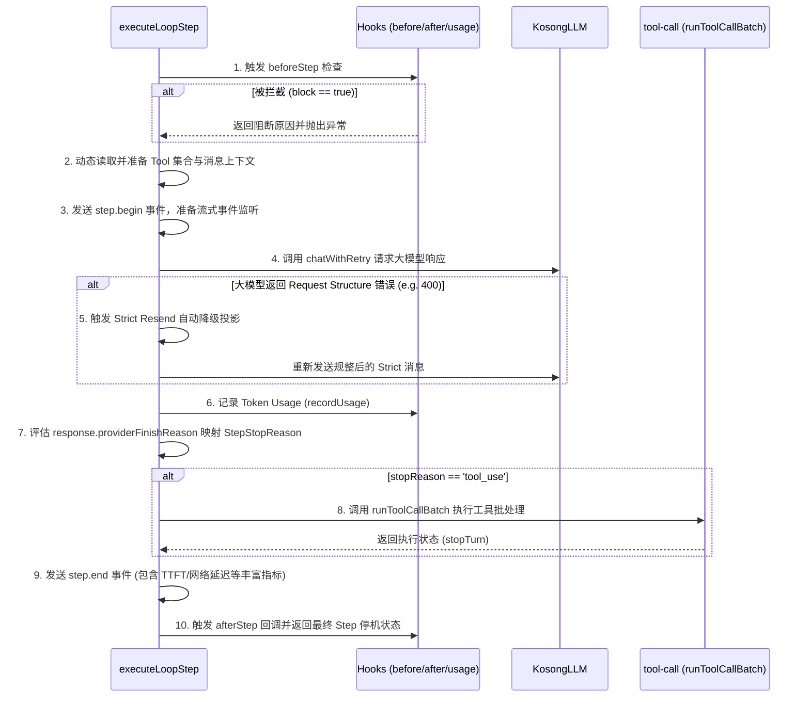

# Kimi Code 执行循环深潜解析：run-turn 与 turn-step

> 范围说明：本文分析的是 `packages/agent-core`（legacy v1）中的循环。`kimi web` 当前始终使用 `packages/agent-core-v2`；CLI/TUI 默认仍走 v1，只有启用 `KIMI_CODE_EXPERIMENTAL_FLAG` 才切换 v2。当前 v2 runtime 的分析与架构图见 [Agent Loop Runtime](agent-loop-runtime.md)。

本文档深入剖析智能体核心循环的两个关键模块：负责 Turn 级别宏观控制的 [run-turn.ts](../../../../kimi-code/packages/agent-core/src/loop/run-turn.ts) 以及负责单步执行大模型调用与工具收尾的 [turn-step.ts](../../../../kimi-code/packages/agent-core/src/loop/turn-step.ts)。

---

## 1. Turn 级别循环控制：[run-turn.ts](../../../../kimi-code/packages/agent-core/src/loop/run-turn.ts)

`run-turn.ts` 定义了主执行循环函数 [runTurn](../../../../kimi-code/packages/agent-core/src/loop/run-turn.ts#L70)。该函数是**无状态（Stateless）**的，所有的状态维护和持久化均通过入参中的各类辅助构建器与 Hooks 委托给外部（如会话上下文管理）处理。

### 1.1 输入参数接口 [RunTurnInput](../../../../kimi-code/packages/agent-core/src/loop/run-turn.ts#L33)
* `turnId` / `signal`：会话 Turn 唯一标识与终止控制信号。
* `llm`：抽象大模型实例（提供带有 Token Budget 解析的 Chat 客户端）。
* `buildMessages` / `buildMessagesStrict`：用于构建 LLM 请求上下文历史消息的延迟加载构建器。
* `buildTools` / `tools`：支持在步骤运行中动态更新工具定义列表（以适配工具的渐进式披露，例如大模型动态调用 `select_tools` 进行工具清单加载）。
* `hooks`：包括 `beforeStep`、`afterStep` 及 `shouldContinueAfterStop` 等回调钩子。
* `maxSteps`：单次 Turn 中允许模型循环执行的最大步数限制，以防止模型陷入无休止的“自我纠错”或“工具重复调用”。

### 1.2 `runTurn` 核心控制流与状态机

```mermaid
state-chart
[*] --> InitUsage: 1. 初始化 TokenUsage
InitUsage --> CheckAbort: 2. 检查 AbortSignal
CheckAbort --> CheckMaxSteps: 3. 判断 steps < maxSteps
CheckMaxSteps --> RunStep: 4. 执行 executeLoopStep
RunStep --> HandleResult: 5. 校验 Step 返回结果

alt stopReason == 'tool_use'
    HandleResult --> CheckAbort: 重复下一次 Step
else stopReason == 终端状态
    HandleResult --> CheckContinuation: 6. 触发 shouldContinueAfterStop
end

CheckContinuation --> [*]: (continue != true) 正常退出
CheckContinuation --> CheckAbort: (continue == true) 继续执行
```

### 1.3 关键异常与中断捕获机制
[runTurn](../../../../kimi-code/packages/agent-core/src/loop/run-turn.ts#L70) 的设计非常注重异常处理与中断上报：
1. **主动用户中断**：在 `catch` 块中判断 `isUserCancellation(signal.reason)`。如果是用户在 TUI 或通过 RPC 发起的取消动作，会上报 `turn.interrupted` 事件并将 `interruptReason` 置为 `'user_cancelled'`，然后正常返回当前已消耗的步骤和 Token，防止异常崩溃。
2. **超时或被动取消**：其他原因导致的 Abort 信号触发会被归类为 `'aborted'`。
3. **超出最大步数限制**：在步骤累加到 `maxSteps` 时会抛出 `createMaxStepsExceededError`，在 `catch` 中上报 `turn.interrupted`，原因标记为 `'max_steps'` 并将异常重新抛出。

---

## 2. 单步 LLM 执行与工具调用桥梁：[turn-step.ts](../../../../kimi-code/packages/agent-core/src/loop/turn-step.ts)

`turn-step.ts` 定义了单步执行逻辑 [executeLoopStep](../../../../kimi-code/packages/agent-core/src/loop/turn-step.ts#L57)，它控制着从大模型调用到拉起工具执行的整个生命周期。

### 2.1 执行时序分析



### 2.2 关键设计机制：Strict Resend (严格模式自愈)
由于不同厂商（如 Anthropic 与 OpenAI）以及各类推理模型对会话历史消息的格式要求极度严苛（例如：要求 `user` 和 `assistant` 必须交替、不能连续发送同角色的消息、最后一条 `assistant` 的工具调用必须配对 `tool_result` 等），在上下文因为截断或压缩处理后，可能破坏协议的规整性。

```typescript
// turn-step.ts 关键片段 (L144-L182)
try {
  response = await chatWithRetry({ ...retryInput, params: chatParams });
} catch (error) {
  // 如果大模型因为消息结构问题返回报错，并且提供了严格构建器 (buildMessagesStrict)
  if (buildMessagesStrict === undefined || !isRecoverableRequestStructureError(error)) throw error;

  // 重新构建排版绝对合规的消息历史
  const strictMessages = await buildMessagesStrict();
  try {
    response = await chatWithRetry({
      ...retryInput,
      params: { ...chatParams, messages: strictMessages },
    });
  } catch (strictError) {
    // 若重发依然失败，则记录致命异常并向上抛出
    throw strictError;
  }
}
```
该自愈机制作为最后一道防线，最大程度地避免了因为不同平台模型 API 对历史消息格式校验的差异导致的用户会话“鬼打墙”或永久报错。

### 2.3 终结状态映射 [deriveStepStopReason](../../../../kimi-code/packages/agent-core/src/loop/turn-step.ts#L276)
在拿到大模型返回结果后，系统会检查其 `providerFinishReason`（由适配层 [packages/kosong](../../../../kimi-code/packages/kosong) 翻译）：
* `'truncated'` $\rightarrow$ `'max_tokens'` (上下文溢出/生成受限)
* `'filtered'` $\rightarrow$ `'filtered'` (内容风控被拦截)
* `'paused'` $\rightarrow$ `'paused'` (推理挂起)
* `'completed'` / `undefined`：根据是否包含工具调用决定返回 `'tool_use'`（继续步骤循环）还是 `'end_turn'`（模型答复完成，退出 Turn）。

### 2.4 指标度量与诊断日志
`step.end` 事件中分发了极为详尽的性能统计字段（详见 `logStepTiming`），便于分析慢查询：
* `requestBuildMs`：客户端构建并打包提示词耗时。
* `serverFirstTokenMs`：网络往返到大模型吐出第一个 Token (TTFT) 的耗时。
* `serverDecodeMs`：模型端解码生成时间。
* `clientConsumeMs`：客户端消费数据流时间。
* `streamDurationMs`：整体流式响应周期。
* `usage`：单步的精确输入/输出/推理 Token。

---

## 3. 两者的协作关系与数据流向

1. [runTurn](../../../../kimi-code/packages/agent-core/src/loop/run-turn.ts#L70) 是一个由**外部条件限制**（如 `maxSteps`，Abort 信道状态）主导的自旋循环。
2. 每次循环，[runTurn](../../../../kimi-code/packages/agent-core/src/loop/run-turn.ts#L70) 会拉起 [executeLoopStep](../../../../kimi-code/packages/agent-core/src/loop/turn-step.ts#L57)。
3. [executeLoopStep](../../../../kimi-code/packages/agent-core/src/loop/turn-step.ts#L57) 消费 [llm.ts](../../../../kimi-code/packages/agent-core/src/loop/llm.ts) 进行接口网络调用，并直接控制和运行由 [tool-call.ts](../../../../kimi-code/packages/agent-core/src/loop/tool-call.ts) 支撑的并发/串行工具调用批处理。
4. 工具执行完毕后产生 `tool.result` 消息，会被隐式追加到下一次循环 `buildMessages` 所读取的历史记录中，为下一步大模型决策提供环境反馈输入。
5. 如此交替，直到 [executeLoopStep](../../../../kimi-code/packages/agent-core/src/loop/turn-step.ts#L57) 返回终端原因（例如 `'end_turn'`），由 [runTurn](../../../../kimi-code/packages/agent-core/src/loop/run-turn.ts#L70) 作最终的状态转换并闭合退出。
